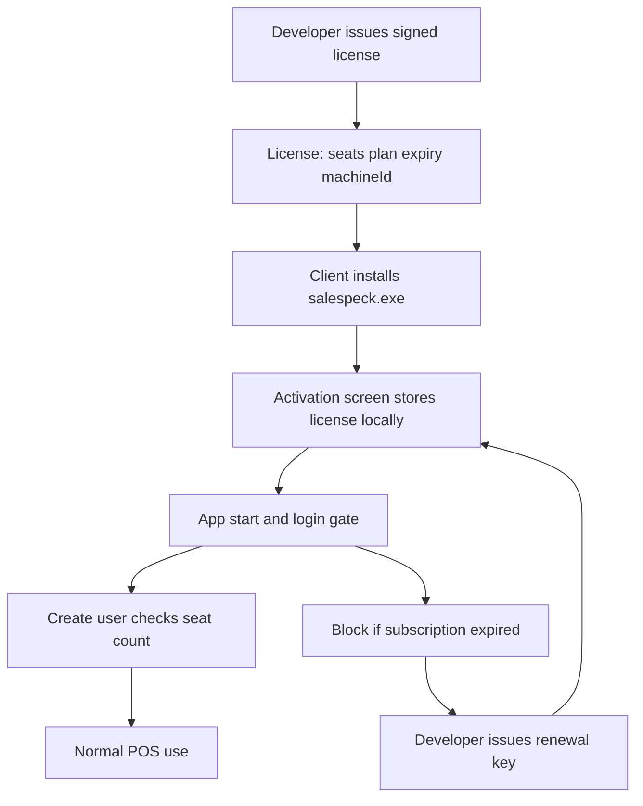

# SalesPeck — Client Deployment & Licensing Roadmap

Operational guide for packaging, delivering, and commercially gating the desktop POS for clients.

**Related docs**

- [**Build & Deploy (from scratch)**](./BUILD_AND_DEPLOY.md) — full build, publish, license, client install
- [Update Release Guide](./update-release.md) — build, upload, post-update migrate/backup
- [Client Onboarding](./CLIENT_ONBOARDING.md) — on-site handoff checklist
- [Licensing](./LICENSING.md) — issue / activate keys
- [Dev Quickstart](./dev-quickstart.md) — local development
- [Local Installed Update Test](./test-local-installed-update.md) — verify auto-update before shipping

---

## 1. Goals & scope

| Goal | v1 approach |
|------|-------------|
| Deliver a Windows desktop POS to a client | NSIS installer via electron-builder (`desktop/`) |
| Multi-user access | Local staff logins (`branchmanager`, `user`) on shared SQLite |
| Developer-controlled seat limit | Signed license carries `maxUsers`; app enforces on user create |
| Monthly / yearly subscription | Signed license carries `plan` + `expiresAt`; app blocks login when expired |
| Offline-first shop use | License verified locally (public-key check); no Stripe in-app for v1 |

**Seat definition:** only staff accounts (`branchmanager` + `user`) count. `customer` and `vendor` rows do **not** consume seats.

**Non-goals (v1)**

- In-app Stripe / card checkout
- Cloud multi-tenant sync (see `z-future-data-sync-logic.md` only)
- Mac / Linux installers
- Concurrent-login seat tracking across machines (optional later with machine fingerprint)

---

## 2. Architecture (target)



| Component | Responsibility |
|-----------|----------------|
| Developer CLI / script | Issue signed payload (`maxUsers`, `plan`, `expiresAt`, client id) |
| App public key (embedded) | Verify signature; reject tampered licenses |
| `%APPDATA%\salespeck\license.json` | Persist activated license + signature |
| Startup / login middleware | Require valid, non-expired license |
| User create / register | Reject when staff count ≥ `maxUsers` |
| Settings UI | Show plan, seats used/remaining, expiry |

**License payload (proposed)**

```json
{
  "licenseId": "uuid",
  "clientName": "Acme Tailors",
  "maxUsers": 5,
  "plan": "yearly",
  "issuedAt": "2026-08-05T00:00:00.000Z",
  "expiresAt": "2027-08-05T00:00:00.000Z",
  "features": [],
  "machineFingerprint": null
}
```

Sign the canonical JSON with the developer private key; store `{ payload, signature }` locally. Optional `machineFingerprint` binds the key to one PC.

**Grace period:** allow a short grace (e.g. 7 days after `expiresAt`) with a banner; after grace, only the activation / renew screen is reachable.

---

## 3. Commercial model

| Plan | Typical term | Renewal |
|------|--------------|---------|
| `monthly` | 30 days from issue (or calendar month) | New signed key |
| `yearly` | 365 days from issue | New signed key |

**Seat packs:** sold as `maxUsers` (e.g. 1, 3, 5, 10). Upgrading seats mid-term = new key with higher `maxUsers` and same or extended `expiresAt`.

**Pricing / payment:** collected outside the app (invoice, bank transfer, etc.). Developer issues the key after payment is confirmed.

**Tracking (developer side):** spreadsheet or private DB of issued `licenseId`, client, seats, plan, expiry — outside the client app for v1.

---

## 4. Codebase gap analysis (what exists vs what is missing)

### 4.1 What works today

| Area | Status | Touchpoints |
|------|--------|-------------|
| Electron + Express POS | Working | `desktop/main.js`, `desktop/server/app.js` |
| Local SQLite (Prisma) | Working | `desktop/prisma/`, `%APPDATA%\salespeck\stitch.sqlite` |
| Windows NSIS build | Working | `desktop/package.json` → `npm run build` → `dist/salespeck.exe` |
| Auto-update plumbing | Partial | `electron-updater`, `update_url` in `.settings` |
| Multi staff logins | Working (unlimited) | `user` table, login/register |
| Post-update migrate + DB backup | Working (packaged) | See [update-release.md](./update-release.md) |

### 4.2 Brand / packaging (updated)

OpenMenu branding has been unified to **SalesPeck** / **`salespeck`** (paths, upload artifact, AppData, docs).

| Item | Status |
|------|--------|
| Product / AppData / upload names | Done |
| GitLab package folder | Ops: create `packages/generic/salespeck/release` on first upload |
| Legacy installs | Older `%APPDATA%\stitchcore` or `%APPDATA%\openmenu` — migrate settings/DB manually if needed |
| Session secret / `.env` exclusion | Done (Phase A) |
| Authenticode signing | Documented; needs a cert on the release PC |

**Paths:** installer/`productName` `salespeck`; settings/uploads/DB under `%APPDATA%\salespeck`; upload `dist/salespeck.exe`.

Full procedure: [BUILD_AND_DEPLOY.md](./BUILD_AND_DEPLOY.md).

### 4.3 Security / production hygiene

| Item | Status |
|------|--------|
| Session secret | **Done** — per-install `session_secret` in `.settings` |
| `.env` in build | **Done** — excluded from electron-builder `files` |
| Password hashing | **Done** — bcrypt; legacy upgrade on login |
| Permissions / RBAC | **Done** — role-based; `allowed()` enforces |
| Code signing | Documented; certificate still required on release machine |
| Client update auth | Upload uses `GITLAB_TOKEN`; end-user feed should be reachable (public or tokenized) |

### 4.4 Licensing / subscription

| Capability | Status |
|------------|--------|
| License schema / file | **Done** — `license.json` |
| Activation UI | **Done** — `/license/activate` |
| Startup / login gate on expiry | **Done** — middleware + 7-day grace |
| `maxUsers` enforcement | **Done** — staff roles only |
| Developer `issue-license` CLI | **Done** — `npm run license:issue` |
| License status in Settings | **Done** |
| Machine binding | **Done (optional)** — `--bind` / `--fingerprint` |

### 4.5 Auth / seats today (relevant facts)

- Roles: `branchmanager` (first register), `user` (staff), `customer` / `vendor` (parties).
- Staff seats capped by license `maxUsers` (`branchmanager` + `user` only).
- Electron `requestSingleInstanceLock()` → one window per machine (not a commercial multi-PC seat).
- LAN “switch server” can point UI at another host’s Express; still one SQLite server process — not multi-tenant cloud.

---

## 5. Phased implementation backlog

### Phase A — Packaging & brand hygiene

- [x] Align product names/paths to **`salespeck`** / **SalesPeck** (done in prep rebrand)
- [x] Document GitLab `packages/generic/salespeck/release` requirement (create folder on first upload; see [update-release.md](./update-release.md))
- [x] Per-install `session_secret` generated into writable `.settings` (not hardcoded; hidden from Settings UI)
- [x] Exclude developer `.env` from electron-builder packaged `files`
- [x] Document Authenticode signing — [CODE_SIGNING.md](./CODE_SIGNING.md)
- [x] Update [update-release.md](./update-release.md) install paths after rename

### Phase B — License + subscription (core commercial)

**Data**

- [x] License file under app data (`license.json` + signature)
- [x] Embed public key in app; private key only under `config/license-keys/private.pem` (gitignored)

**App gates**

- [x] Activation / renew screen (`/license/activate`)
- [x] Middleware: block app use if missing / invalid / expired (after 7-day grace) except activation routes
- [x] Count staff seats vs `maxUsers` on register + user create
- [x] Settings → License panel (plan, expiry, seats)

**Developer tooling**

- [x] `npm run license:issue -- --seats 5 --plan yearly --client "Acme" --days 365`
- [x] CSV log: `config/license-keys/issued-licenses.csv` (gitignored)

See [LICENSING.md](./LICENSING.md).

### Phase C — Client onboarding process (ops)

Documented in [CLIENT_ONBOARDING.md](./CLIENT_ONBOARDING.md). Order: **activate license first**, then register branch manager, then staff up to seats.

### Phase D — Hardening (before wide rollout)

- [x] Wire role-based permissions (`branchmanager` = full; `user` = POS/staff subset); `allowed()` enforces them
- [x] bcrypt password hashing for new passwords; legacy hashes upgrade on successful login
- [x] Document SQLite backup/restore — [BACKUP_RESTORE.md](./BACKUP_RESTORE.md)
- [x] Packaged update test procedure remains [test-local-installed-update.md](./test-local-installed-update.md) (run on a Windows install before wide release)
- [x] Optional machine fingerprint binding — `npm run license:issue -- ... --bind` or `--fingerprint <hash>`

---

## 6. Release & install process (operator checklist)

### Build & publish

1. Update version in [`desktop/package.json`](../desktop/package.json).
2. Ensure Prisma schema/migrations committed.
3. `cd desktop && npm run prisma:generate`
4. `npm run build` → expect installer under `desktop/dist/` (today: `salespeck.exe` / NSIS).
5. Sign the installer (Authenticode) when certificates are available.
6. `npm run upload` — uploads `salespeck.exe` + `latest.yml` to GitLab `salespeck/release`.
7. Smoke-test update feed URL used in client `.settings` `update_url`.

Step-by-step from scratch: [BUILD_AND_DEPLOY.md](./BUILD_AND_DEPLOY.md).

### Fresh client machine

1. Run installer (admin if NSIS requires it).
2. Launch app; confirm DB created under salespeck app data.
3. Activate license (Phase B).
4. Register branch manager / create staff within seat limit.
5. Verify: login, sale, purchase, report, settings.
6. Confirm auto-update check does not error loudly on 404 (or points at your release feed).

### Paths to know (current)

| Purpose | Path |
|---------|------|
| Installer / programs | `%LOCALAPPDATA%\Programs\salespeck` |
| Updater cache | `%LOCALAPPDATA%\salespeck-updater` |
| Settings / uploads / logs | `%APPDATA%\salespeck` |
| SQLite DB | `%APPDATA%\salespeck\stitch.sqlite` (dev: `desktop/db/stitch.sqlite`) |

Brand paths are unified. Remaining ops before wide rollout: Authenticode cert, first GitLab package folder, packaged update smoke test — see [BUILD_AND_DEPLOY.md](./BUILD_AND_DEPLOY.md).

---

## 7. Client delivery checklist

**Before visit / remote install**

- [ ] Contract: seats, plan (monthly/yearly), price, support hours
- [ ] License prepared (`licenseId`, `maxUsers`, `expiresAt`)
- [ ] Signed installer version recorded
- [ ] Company name, phone, address for settings
- [ ] Staff list (usernames) within seat pack

**On site / remote**

- [ ] Install + license activate
- [ ] Branch manager + staff users
- [ ] Printer / paper settings if used
- [ ] Sample sale / service sale / return if enabled
- [ ] Backup location explained to client
- [ ] Support contact + renewal date written down

**Handoff**

- [ ] Client can log in and complete a sale unassisted
- [ ] Developer license log updated
- [ ] Renewal reminder scheduled ~14 days before expiry

---

## 8. Ops: renewals, seat upgrades, support

| Event | Process |
|-------|---------|
| Monthly/yearly renewal | Invoice → payment → issue new key with new `expiresAt` → client pastes on Activation screen |
| Seat upgrade | Issue new key with higher `maxUsers` (same or new term) → re-activate |
| Seat downgrade | New key with lower `maxUsers` only if current staff count ≤ new limit (else archive/disable users first) |
| Lost license file | Re-issue same entitlement from developer log (same `licenseId` or new id) |
| PC replacement | New machine fingerprint key if binding enabled; else re-activate same key |
| Expired + grace over | App locked to activation; data remains in SQLite until renewed |
| Support | Collect app version, licenseId, seats used, and DB backup if investigating data issues |

---

## 9. Suggested implementation order (engineering)

1. **Phase A** brand/upload/secrets (unblocks trustworthy installs).
2. **Phase B** license issue + activate + expiry gate + seat cap (unblocks commercial model).
3. **Phase C** run first paid pilot with the ops checklist.
4. **Phase D** RBAC, hashing, backup docs, signing, update hardening.

---

## 10. Explicit v1 non-goals (restate)

- No Stripe/PayPal inside the desktop app
- No cloud sync / multi-branch online dashboard (future doc only)
- No Mac/Linux packages
- No automatic online payment → auto key issuance (can add a small license portal later)

---

## Appendix A — Key source files

| Area | Path |
|------|------|
| Packaging | `desktop/package.json`, `desktop/build/upload.js`, `desktop/build/installer.nsh` |
| Electron / updates | `desktop/main.js` |
| Config | `desktop/installEnv.js` |
| Auth | `desktop/controllers/mainController.js`, `desktop/middleware/sessionData.js`, `desktop/middleware/isAllowed.js` |
| Users | `desktop/controllers/userController.js`, `desktop/prisma/schema.prisma` (`user`) |
| DB path | `desktop/utils/prismaDbConfig.js` |
| Existing release doc | `z-docs/update-release.md` |

## Appendix B — Example developer license command (to implement)

```bash
cd desktop
node scripts/issue-license.js \
  --seats 5 \
  --plan yearly \
  --client "Acme Tailors" \
  --days 365 \
  --out ./licenses/acme-2026.json
```

Output: signed JSON the client pastes or imports into Activation.

---

*Document version: 1.0 — aligns with codebase review (Electron + Prisma SQLite, no licensing yet). Update this file when Phase A/B land.*
