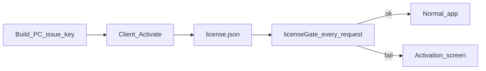
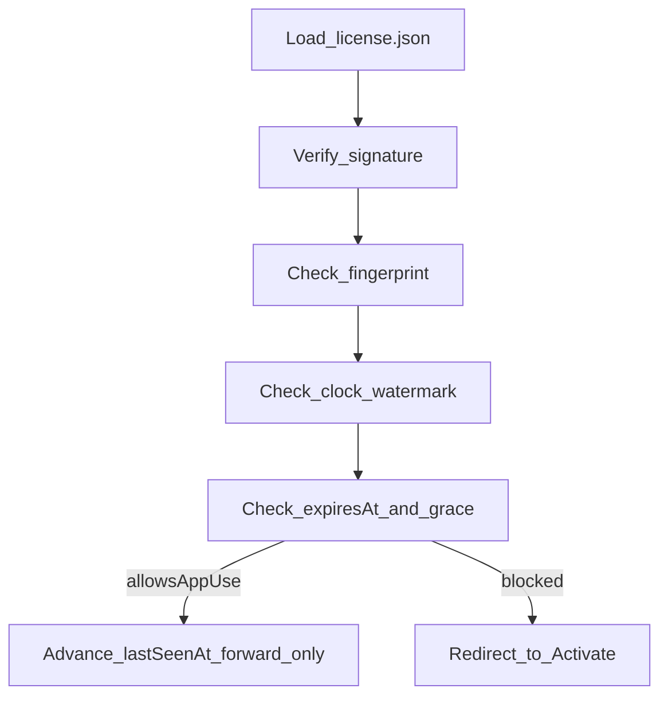

# SalesPeck — Licensing architecture (simple guide)

How license keys, fingerprints, clock protection, and the activation gate work inside the app.

Operator commands: [LICENSING.md](./LICENSING.md) · [OPERATOR_DEPLOY.md](./OPERATOR_DEPLOY.md)

Core code: [`desktop/utils/license.js`](../desktop/utils/license.js)

---

## 1. Big picture



| Role | What they do |
|------|----------------|
| **Build PC** | Signs a license with a **private key** (`private.pem`) |
| **App** | Only has the **public key** (embedded in code) |
| **Client** | Pastes Base64 key → app verifies → saves `license.json` |
| **Every page** | Re-checks signature, fingerprint, clock, expiry |

---

## 2. Issuing a key (build PC)

Script: [`desktop/scripts/issue-license.js`](../desktop/scripts/issue-license.js)

1. Build a **payload**: client name, seats (`maxUsers`), plan, `issuedAt`, `expiresAt`, optional `machineFingerprint`.
2. Sign the payload with `config/license-keys/private.pem` (Ed25519) → `signature`.
3. Encode `{ payload, signature }` as Base64 → the long string starting with `eyJ...`.
4. Append a row to `issued-licenses.csv` (gitignored).

Example:

```powershell
cd desktop
npm run license:issue -- --seats 7 --plan monthly --client "XYZ" --days 31
# Machine-bound (preferred):
npm run license:issue -- --seats 7 --plan monthly --client "XYZ" --days 31 --fingerprint <hash>
```

`--fingerprint` puts the PC id **inside the signed payload**. Changing it without the private key breaks the signature.

---

## 3. Fingerprint (“This PC fingerprint”)

Function: `getMachineFingerprint()` in `license.js`.

Builds a string from:

- hostname  
- OS platform  
- CPU arch  
- Windows username  
- CPU model  

Hashes with SHA-256 → first **32 hex characters** (example: `50546247123cf036a65316c375917483`).

Shown on **License Activation** and **Settings → License** so the operator can issue a bound key.

### Two bind modes

| Mode | Meaning |
|------|---------|
| **Signed** | Key was issued with `--fingerprint` / `--bind`. Payload must match this PC. |
| **Bound on activate** | Key had no fingerprint; on first Activate the app stores `boundFingerprint` in `license.json`. |

On every check: if signed **or** bound fingerprint ≠ this PC → reject (“bound to another machine”).

Major hardware change or Windows user rename can change the fingerprint → re-issue a key for the new hash.

---

## 4. Activation (client)

`activateLicense(rawKey)`:

1. Decode Base64 → JSON (`payload` + `signature`).
2. Verify signature with embedded public key (`EMBEDDED_PUBLIC_KEY_PEM`).
3. If payload has `machineFingerprint` → must match this PC.
4. Reject if system clock is far before `issuedAt` (1-day skew allowed).
5. Save license file (and start clock watermark).

### What `license.json` looks like

```json
{
  "payload": {
    "licenseId": "...",
    "clientName": "XYZ",
    "maxUsers": 7,
    "plan": "monthly",
    "issuedAt": "...",
    "expiresAt": "...",
    "machineFingerprint": null
  },
  "signature": "...",
  "activatedAt": "...",
  "boundFingerprint": "this_pc_hash",
  "lastSeenAt": "..."
}
```

`lastSeenAt` is also mirrored in the database as softwaresetting `license_last_seen` (harder to reset by deleting only the file).

---

## 5. Runtime check (every request + startup)

`getLicenseStatus()` is called by:

- [`desktop/middleware/licenseGate.js`](../desktop/middleware/licenseGate.js) on almost every HTTP request  
- [`desktop/main.js`](../desktop/main.js) once at app startup (after DB bootstrap)



### Clock guard (from 1.0.13)

- Remember last successful check time (`lastSeenAt` + DB).
- Only move that time **forward**.
- If PC clock jumps **back** more than ~2 hours → state `clock_tamper` → app blocked until clock is fixed.
- If clock is before license issue date → state `clock_invalid`.

Offline only — no internet time server.

### Expiry

| State | Behavior |
|-------|----------|
| Before `expiresAt` | Valid — full use |
| Up to **7 days** after | Grace — usable, warning banner |
| After grace | Gated to activation until a new key is pasted |

### Seats

Only roles `branchmanager` and `user` count toward `maxUsers`. Customers/vendors do not use seats.

### Gate allow-list

These paths work even without a valid license: `/license/*`, `/assets`, `/uploads`, `/logout`, etc. Everything else redirects to `/license/activate` when `allowsAppUse` is false.

---

## 6. Where files live

| Item | Installed app | Development |
|------|---------------|-------------|
| Live license | `%APPDATA%\salespeck\license.json` | `desktop/license.json` |
| Clock mirror | DB `softwaresetting` → `license_last_seen` | Same (dev SQLite) |
| Business database | `%APPDATA%\salespeck\stitch.sqlite` | `desktop/db/stitch.sqlite` |
| Private key (issue only) | Never on client | `desktop/config/license-keys/private.pem` |
| Public key | Inside app binary / `license.js` | Same source file |

Renewing a license **does not** wipe `stitch.sqlite` (sales/stock data).

---

## 7. Mental model

1. **Key** = signed contract (who, seats, dates, optional PC).  
2. **Activate** = save contract + bind to this PC + start clock watermark.  
3. **Every open / page** = “Signature OK? Right PC? Clock not rolled back? Not past grace?”  
4. **Renew** = issue a new key (prefer `--fingerprint`) → paste again → overwrite `license.json`.

### Preferred renewal steps

1. Client: **Settings → License** → copy **This PC fingerprint** (the hex string, not the `eyJ...` key).  
2. Build PC: `npm run license:issue -- ... --fingerprint <that_hash>`.  
3. Client: paste the new `eyJ...` key → **Activate**.

---

## 8. Related code map

| Piece | Location |
|-------|----------|
| Core logic | `desktop/utils/license.js` |
| Issue CLI | `desktop/scripts/issue-license.js` |
| HTTP gate | `desktop/middleware/licenseGate.js` |
| Activate UI | `desktop/views/license/activate.ejs` |
| Activate routes | `desktop/routes/licenseRoutes.js` + `controllers/licenseController.js` |
| Settings License tab | `desktop/views/settings/index.ejs` |
| Startup check | `desktop/main.js` (`ensureLicenseImported` + `getLicenseStatus`) |
