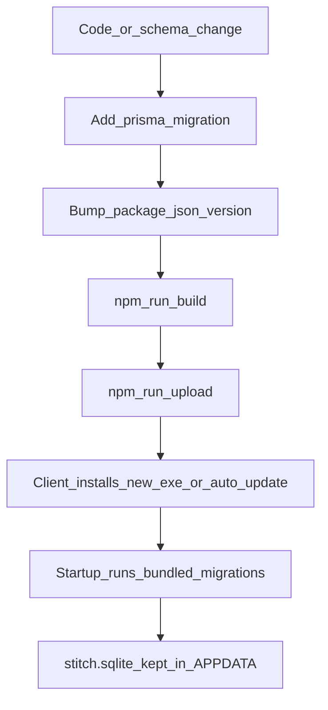

# SalesPeck — Operator deploy guide

Simple commands and procedures for building, installing, updating clients **without losing data**, and renewing licenses.

Deeper references: [BUILD_AND_DEPLOY.md](./BUILD_AND_DEPLOY.md) · [LICENSING.md](./LICENSING.md) · [LICENSING_ARCHITECTURE.md](./LICENSING_ARCHITECTURE.md) (how license/fingerprint/clock work) · [BACKUP_RESTORE.md](./BACKUP_RESTORE.md) · [DEPLOY_XYZ.md](./DEPLOY_XYZ.md) (XYZ checklist)

---

## 1. Paths cheat-sheet

| What | Path |
|------|------|
| Installed app | `%LOCALAPPDATA%\Programs\salespeck` |
| Client data (DB, license, settings) | `%APPDATA%\salespeck\` |
| Live database | `%APPDATA%\salespeck\stitch.sqlite` |
| Activated license | `%APPDATA%\salespeck\license.json` |
| Client settings | `%APPDATA%\salespeck\.settings` |
| Dev database (editor) | `desktop/db/stitch.sqlite` |
| Installer output | `desktop/dist/salespeck.exe` |
| Update metadata | `desktop/dist/latest.yml` |
| Signing private key (never commit) | `desktop/config/license-keys/private.pem` |

**Ship to the client:** only the installer (and optional `license-key.txt`).  
**Never copy:** `win-unpacked`, the whole `dist` folder, or `node_modules`.

---

## 2. Scenario A — Project already open (development machine)

Use this when the repo is already on disk (e.g. Cursor / VS Code).

```powershell
cd D:\corelogix\pos\stitchcore\desktop

npm install
npm run prisma:generate

# 1) Edit package.json → bump "version" (e.g. 1.0.12 → 1.0.13) when releasing
# 2) If schema changed: add a folder under prisma/migrations/ (see section 5)

$env:CSC_IDENTITY_AUTO_DISCOVERY = 'false'
npm run build
npm run upload

# Issue / renew a client license (example: XYZ, 7 seats, ~1 month)
npm run license:issue -- --seats 7 --plan monthly --client "XYZ" --days 31
```

Optional USB pack for one client:

```powershell
New-Item -ItemType Directory -Force -Path dist\deploy-xyz | Out-Null
Copy-Item dist\salespeck.exe dist\deploy-xyz\salespeck-<version>.exe
# Copy the printed Base64 key into dist\deploy-xyz\license-key.txt
```

Upload needs `GITLAB_TOKEN` in `desktop/.env` (build machine only).

---

## 3. Scenario B — Fresh clone from Git

```powershell
git clone <your-repo-url> stitchcore
cd stitchcore\desktop

npm install
npm run prisma:generate

# Restore secrets (NOT in git):
#   - config/license-keys/private.pem  (from secure backup)
#   - config/license-keys/public.pem
#   - .env with GITLAB_TOKEN=glpat-...

# Confirm EMBEDDED_PUBLIC_KEY_PEM in utils/license.js matches public.pem
# First-time keys only (if you have none):
#   npm run license:keys

$env:CSC_IDENTITY_AUTO_DISCOVERY = 'false'
npm run build
npm run upload
```

If `private.pem` is missing you can still build the app, but you **cannot** issue new license keys.

---

## 4. First-time client install

1. Uninstall any old SalesPeck (Apps).
2. For a **brand-new** PC only: you may clear `%APPDATA%\salespeck` before first install.  
   **After go-live, never delete that folder** — it holds the database.
3. Run `salespeck.exe` (or `dist\deploy-<client>\salespeck-*.exe`).
4. Confirm title shows the expected version (e.g. `SalesPeck v1.0.12`).
5. **License Activation** → paste full key from `license-key.txt` (must start with `eyJ`).
6. **Register** branch manager → login.
7. Smoke-test: Settings → License, one sale, restart.

Client checklist example: [DEPLOY_XYZ.md](./DEPLOY_XYZ.md).

---

## 5. Later changes without losing client data



### Rules

1. **Schema changes** → add a real migration under `desktop/prisma/migrations/` (do not rely on `prisma db push` for packaged clients).
2. **Bump** `desktop/package.json` `version` → `npm run build` → `npm run upload`.
3. On the client: install the new exe **or** accept the auto-update.  
   **Do not** delete `%APPDATA%\salespeck` or `stitch.sqlite`.
4. On startup, the app applies pending bundled migrations to the existing DB.
5. Before risky updates: **Export DB** in the app, or copy `stitch.sqlite` (see [BACKUP_RESTORE.md](./BACKUP_RESTORE.md)).
6. Never restore a **newer** database onto an **older** app version.

### Safe update on an existing client

```text
Close SalesPeck → (optional backup) → install new salespeck.exe → start app → verify login + one screen
```

Uninstalling the **program** is OK; data lives under `%APPDATA%\salespeck` and survives a normal uninstall.  
Deleting `%APPDATA%\salespeck` **wipes** the client database and license file.

---

## 6. Subscription expiry and renewal

| State | Behavior |
|-------|----------|
| Before `expiresAt` | Full use |
| Up to **7 days** after expiry | Grace (banner; app still usable) |
| After grace | Gated to License Activation until a new key is activated |

Expiry uses the **PC’s local date/time**.

### Renew (or change seats) on the build PC

```powershell
cd desktop
npm run license:issue -- --seats 7 --plan monthly --client "XYZ" --days 31
# Yearly example:
npm run license:issue -- --seats 7 --plan yearly --client "XYZ" --days 365
```

### On the client

1. Open **Settings → License** (or `/license/activate`).
2. Paste the **new** full key → Activate.
3. Confirm new expiry / seats.

Renewal **does not** wipe the database. Creating a new key with a higher `--seats` upgrades the seat limit after activation.

### Preferred: machine-bound renewal

1. On the client: **Settings → License** (or Activate screen) → copy **This PC fingerprint**.
2. On the build PC:

```powershell
npm run license:issue -- --seats 7 --plan monthly --client "XYZ" --days 31 --fingerprint <hash>
```

3. Client pastes the new key → Activate.

From **1.0.13**, activation also auto-binds unbound keys to the current PC (`boundFingerprint`). A key issued with `--fingerprint` is signed to that machine only.

---

## 7. Clock rollback protection (from 1.0.13)

The app records a forward-only **last seen** time in `license.json` and mirrors it in the DB (`license_last_seen`).

- If the PC clock jumps **backward** by more than ~2 hours vs last seen → license state `clock_tamper` → app blocked until the clock is corrected.
- If the clock is set to before the license **issue** date (minus 1 day skew) → `clock_invalid`.
- Correcting the system date/time restores access when still within expiry / 7-day grace.

**Limits:** Offline apps cannot use a trusted internet clock. Deleting both `license.json` and the `license_last_seen` setting resets the watermark; the user still needs a valid key that matches this PC’s fingerprint.

---

## 8. Quick command index

| Task | Command |
|------|---------|
| Install deps | `cd desktop` → `npm install` |
| Prisma client | `npm run prisma:generate` |
| Build installer | `$env:CSC_IDENTITY_AUTO_DISCOVERY='false'; npm run build` |
| Upload to GitLab | `npm run upload` |
| Generate signing keys (once) | `npm run license:keys` |
| Issue license | `npm run license:issue -- --seats N --plan monthly\|yearly --client "Name" --days D` |
| Issue bound license | `... --fingerprint <hash>` (copy hash from client License screen) |
| Dev run | `npm run dev` / `npm run start:electron` |

---

## 9. Do / don’t

| Do | Don’t |
|----|--------|
| Copy only `salespeck.exe` (+ license key text) | Copy `win-unpacked` or full `dist` |
| Keep `%APPDATA%\salespeck` after go-live | Delete APPDATA to “fix” updates |
| Add SQL migrations for schema changes | Ship schema-only `db push` to clients |
| Backup before major upgrades | Restore newer DB onto older app |
| Keep `private.pem` offline | Commit `.env` or `private.pem` |
| Prefer `--fingerprint` on renewals | Share one unbound key across many PCs |
